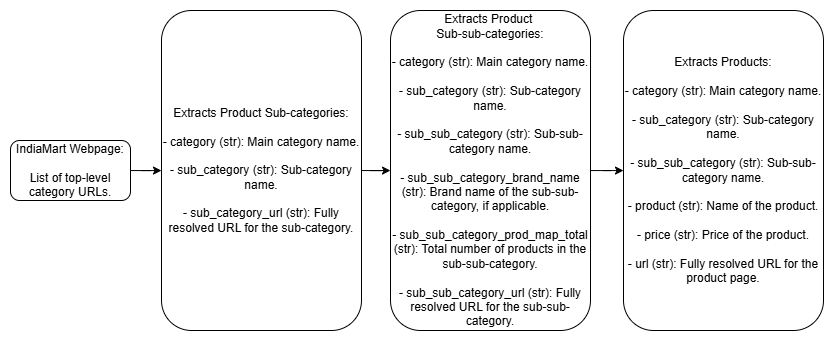

# Slooze Data Engineering Challenge

This project implements an end-to-end data pipeline for extracting, processing, transforming, and storing product listings from [IndiaMART](https://www.indiamart.com/), a major B2B platform. Designed with modularity and scalability in mind, the pipeline ensures robust scraping, structured data handling, and seamless orchestration using modern data engineering tools.

**Note: This application is under active development. You may encounter bugs, missing features, or inconsistent behavior as functionality is being built out and refined. Expect frequent updates, improvements, and new capabilities.**

---

## Objective

The objective of this project is to extract structured and high-quality product data from IndiaMART, transform and clean it using PySpark, and store it in a PostgreSQL database for further analytics and usage. This pipeline automates the complete data journey: from crawling web pages to making the processed data queryable and reliable.

---

## Data Architecture

**Overview:**

- **Input:** List of top-level category URLs (`targets.txt`)
- **Scraping:** Scrapy spiders extract categories, sub-categories, sub-sub-categories, and product listings
- **Intermediate Storage:** All outputs are stored in a shared data volume (`$DATA`) as JSON files
- **Orchestration:** Apache Airflow DAGs manage execution flow across components
- **Processing:** PySpark jobs clean, enrich, and enforce schema on the data
- **Storage:** PostgreSQL database stores structured product data for querying and analytics

---

### Pipeline Flow

1. **Category Extraction**  
   The [`IndiaMartCategory`](IndiaMart/spiders/IndiaMartCategory.py) spider reads `targets.txt` and extracts sub-categories.

2. **Sub-Category Extraction**  
   The [`IndiaMartSubCategory`](IndiaMart/spiders/IndiaMartSubCategory.py) spider processes the sub-category output and extracts sub-sub-categories.

3. **Data Partitioning**  
   A custom Python script (using `pandas`) is executed via an Airflow PythonOperator. It reads `data/sub_sub_category_output.json` and partitions sub-sub-category URLs into logical batches per sub-category. These batches help isolate failures and improve throughput by processing in parallel.

4. **Product Extraction**  
   The [`IndiaMartProduct`](IndiaMart/spiders/IndiaMartProduct.py) spider receives batched inputs and extracts product listings.

5. **Buffered Logging**  
   Airflow writes extracted product listings to intermediate log files grouped by sub-category. These act as buffered staging logs until all related sub-sub-categories are complete, ensuring resumability and consistency.

6. **Data Processing**  
   PySpark jobs read from the staging logs, validate and deduplicate entries, enforce schema, enrich the data, and load the cleaned dataset into the PostgreSQL database.

7. **Orchestration and Monitoring**  
   The entire workflow is managed by an Airflow DAG ([`IndiaMartScraper.py`](orchestration/dags/IndiaMartScraper.py)), deployed within Docker Compose. Errors and logs are surfaced through the Airflow UI.

---

## Technology & Design Justification

- **Scrapy + BeautifulSoup**  
  Scrapy provides a robust, asynchronous scraping framework with built-in support for retries and throttling. BeautifulSoup is used for flexible HTML parsing in irregular structures.

- **Apache Airflow**  
  Airflow provides DAG-based orchestration with scheduling, logging, and failure recovery. It supports reproducible and auditable ETL workflows.

- **Docker Compose**  
  Containers ensure consistent environments for development and deployment. All services (Airflow, Scrapy, PostgreSQL, Redis) are containerized for isolation and repeatability.

- **PostgreSQL**  
  A reliable open-source database used to store structured product data and support analytical queries.

- **PySpark**  
  Handles large-scale data transformations and schema validations in distributed mode.

- **Redis**  
  Used as the CeleryExecutor broker in Airflow, enabling distributed task execution.

- **File-Based Intermediate Storage**  
  Shared volume (`$DATA`) simplifies development, testing, and debugging by avoiding the need for external storage during early pipeline stages.

---

## Data Flow and Schema



---

## Development Approach

- Modular spiders with single-responsibility design for each scraping phase
- Environment-configurable via `.env` and Docker volumes
- Entire infrastructure defined as code (Airflow DAGs, SQL schema, Dockerfiles)
- Clear separation of intermediate and final outputs in a structured filesystem
- SQL schema is created by a dedicated `.sql` script during pipeline initialization

---

## Setup

### 1. Environment Configuration (`.env`)

Create a `.env` file in the project root to override environment variables. If not provided, default values from [`build.sh`](build.sh) are used.

#### Airflow Settings

| Variable                             | Default                          | Description                                |
|--------------------------------------|----------------------------------|--------------------------------------------|
| `AIRFLOW_ADMIN_EMAIL`                | `admin@example.com`              | Admin email                                |
| `AIRFLOW_ADMIN_FIRST_NAME`           | `Administrator`                  | Admin first name                           |
| `AIRFLOW_ADMIN_LAST_NAME`            | `System`                         | Admin last name                            |
| `AIRFLOW_ADMIN_PASSWORD`             | `admin`                          | Admin password                             |
| `AIRFLOW_ADMIN_USERNAME`             | `admin`                          | Admin username                             |
| `AIRFLOW_WEBSERVER_SECRET_KEY`       | `airflowsecretkey`               | Flask secret key                           |
| `AIRFLOW__CELERY__RESULT_BACKEND`    | Derived                          | Result backend connection string           |
| `AIRFLOW__DATABASE__SQL_ALCHEMY_CONN`| Derived                          | SQLAlchemy connection string               |
| `AIRFLOW_CONN_PRODUCTS_DB`           | Derived                          | Connection string for product database     |

#### Data Pipeline Settings

| Variable                             | Default                          | Description                                |
|--------------------------------------|----------------------------------|--------------------------------------------|
| `DATA`                               | `./data`                         | Directory for staging inputs and outputs   |

#### PostgreSQL Settings

| Variable                             | Default                          | Description                                |
|--------------------------------------|----------------------------------|--------------------------------------------|
| `POSTGRES_AIRFLOW_DATABASE`          | `airflow`                        | Database for Airflow metadata              |
| `POSTGRES_AIRFLOW_PASSWORD`          | `airflowpassword`                | Password for Airflow database              |
| `POSTGRES_AIRFLOW_USERNAME`          | `airflow`                        | Username for Airflow database              |
| `POSTGRES_PRODUCTS_DATABASE`         | `products`                       | Database for storing scraped product data  |
| `POSTGRES_PRODUCTS_PASSWORD`         | `productsdatabasepassword`       | Password for product database              |
| `POSTGRES_PRODUCTS_USERNAME`         | `products`                       | Username for product database              |
| `POSTGRES_USERNAME`                  | `postgres`                       | Root PostgreSQL user                       |
| `POSTGRES_PASSWORD`                  | `postgrespassword`               | Root PostgreSQL password                   |

> **Security Warning:** Replace all default credentials with secure values in production environments. Avoid checking `.env` files into version control.

---

### 2. Provide Input: `targets.txt`

Place a list of top-level category URLs in `./data/targets.txt` (or your configured `$DATA/targets.txt`).  
**Format:**  
- One URL per line  
- Each URL should point to a main category page on IndiaMART  
- Example:
    ```text
    https://dir.indiamart.com/industry/builders-hardware.html
    https://dir.indiamart.com/industry/medical-pharma.html
    ```

---

### 3. Build and Deploy the Pipeline

```bash
# Build containers and initialize environment
bash build.sh

# Start all services
docker compose up -d
```

---

## Orchestration: Airflow DAG

The primary DAG is [`IndiaMartScraper.py`](orchestration/dags/IndiaMartScraper.py), which executes the following steps:

- Read `/data/targets.txt` inside the container and run `IndiaMartCategory` spider
- Store output in `/data/sub_category_output.json` inside the container
- Run `IndiaMartSubCategory` spider to extract sub-sub-category URLs
- Save output to `/data/sub_sub_category_output.json` inside the container  
- Partition the sub-sub-category URLs into logical batches using a custom Python script (using `pandas`), triggered via an Airflow PythonOperator
- Trigger `IndiaMartProduct` spiders per batch and log results to sub-category-level staging files a buffered log mechanism that ensures intermediate consistency and resumability.
- After all batches complete, initiate a PySpark job to process logs, enforce schema, deduplicate, and load data into PostgreSQL
- Use a dedicated `.sql` script to define and initialize the database schema

Airflow handles:

- Task scheduling and orchestration
- Dependency resolution
- Error handling and retry mechanisms
- Centralized logging via its web interface

---

## Extending the Pipeline

- **Add new spiders** to [`IndiaMart/spiders`](IndiaMart/spiders) for additional data extraction.
- **Add PySpark jobs** for data cleaning and transformation in the `processor/` directory.
- **Add new Airflow DAGs** in [`orchestration/dags`](orchestration/dags) for more complex workflows.

---

## License

This project is licensed under the [GNU Affero General Public License v3.0](LICENSE).

---